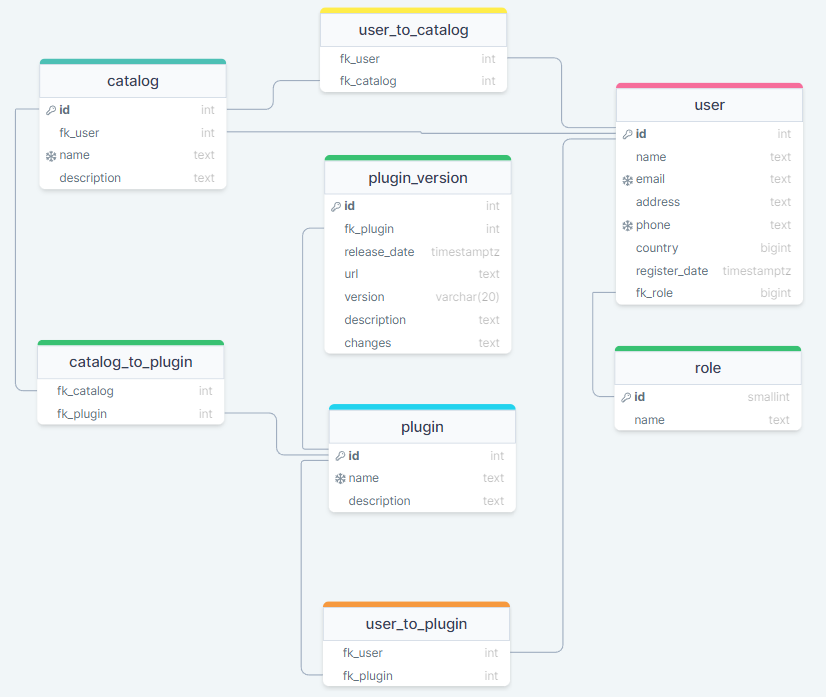

# Проектирование БД.

## Схема

## Документация

Выделено несколько основных сущностей.

- Компания (**company**)
- Пользователь (**user**)
- Плагин, приложение (**plugin**)
- Каталог (**catalog**)

Связь между плагинами и каталогами выполнена как многие ко многим, т.е. плагин может быть в разных каталогах компании.
Для этого использована таблица **catalog_to_plugin**.

Пользователь может иметь права (быть подписанным) на отдельные плагины.
Для связывания пользователей и плагинов используется таблица **plugin_to_user**.

Каждый плагин может иметь различные версии. Для этого существует таблица **plugin_version**. 
Там сохранены различные версии плагина и ссылка на скачивание каждой из версий. 
Есть специальное поле для хранения изменений.

## Примеры бизнес-задач которые решает база

Проект решает задачу по размещению (хостинг) десктоп приложений.
Есть возможность с правами компании создавать каталоги приложений и размещать в них приложения. 
Пользователи в соответствии с правами имеют доступ к отдельным плагинам из них.

Компания загружает в систему плагин, пользователь имеет возможность загружать плагины и подписываться на ожидания обновлений.

## Рекомендации к использованию репликации

В качестве схемы репликации рационально выбрать схему с мастер базой и одной асинхронной репликой,
так как в данной реализации нет критических данных.

## Рекомендации к резервному копированию

В качестве схемы бэкапа рекомендуется дифференциальное копирование, с одним полным бэкапом 1 раз в неделю.
