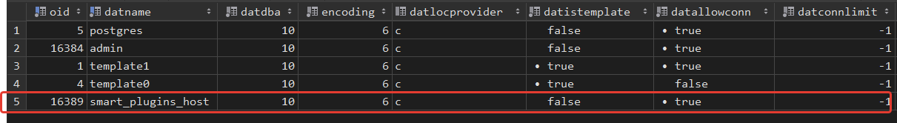
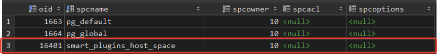
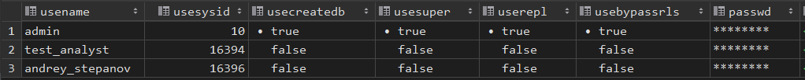
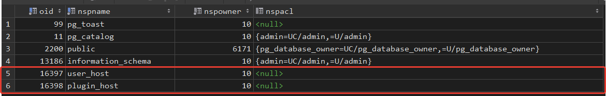

# DDL: создание, изменение и удаление объектов в PostgreSQL .

## Создание базы данных

``` sql
CREATE DATABASE smart_plugins_host;

SELECT * FROM pg_database;
```



## Создание табличного пространства

``` sql
CREATE TABLESPACE smart_plugins_host_space LOCATION '/var/lib/postgresql/data/pgdata';

SELECT * FROM pg_tablespace;
```



## Создание ролей

``` sql
CREATE ROLE analyst;
CREATE ROLE test_analyst IN ROLE analyst LOGIN PASSWORD '12345';

CREATE ROLE developer CREATEDB;
CREATE ROLE andrey_stepanov IN ROLE developer LOGIN PASSWORD '12345';

SELECT * FROM pg_user;
```



## Создание схем данных

``` sql
CREATE SCHEMA user_host;
CREATE SCHEMA plugin_host;

SELECT * FROM pg_namespace;
```

 

## Создание таблиц проекта с распределением по схемам и таличным пространствам

``` sql
CREATE TABLE user_host.role
(
id SMALLINT PRIMARY KEY GENERATED ALWAYS AS IDENTITY,
name TEXT NOT NULL
);

CREATE TABLE user_host.country
(
id INTEGER PRIMARY KEY GENERATED ALWAYS AS IDENTITY,
country VARCHAR(100)
) TABLESPACE smart_plugins_host_space;

CREATE TABLE user_host.user
(
id INTEGER PRIMARY KEY GENERATED ALWAYS AS IDENTITY,
fk_role SMALLINT REFERENCES user_host.role(id),
name VARCHAR(100) NOT NULL CHECK ( length(name) > 3 ),
register_date TIMESTAMP WITH TIME ZONE NOT NULL DEFAULT (NOW() AT TIME ZONE 'utc'),
email VARCHAR(200) NOT NULL UNIQUE,
phone VARCHAR(100) NOT NULL UNIQUE,
fk_country SMALLSERIAL REFERENCES user_host.country(id),
password_hash VARCHAR(128) NOT NULL
) TABLESPACE smart_plugins_host_space;

CREATE TABLE plugin_host.catalog
(
id INTEGER PRIMARY KEY GENERATED ALWAYS AS IDENTITY,
name VARCHAR(100) NOT NULL CHECK ( length(name) > 5 ),
description VARCHAR(300),
fk_user INTEGER REFERENCES user_host.user(id)
) TABLESPACE smart_plugins_host_space;

CREATE TABLE plugin_host.plugin
(
id INTEGER PRIMARY KEY GENERATED ALWAYS AS IDENTITY,
name VARCHAR(100) NOT NULL CHECK ( length(name) > 5 ),
description VARCHAR(300)
) TABLESPACE smart_plugins_host_space;

CREATE TABLE plugin_host.plugin_version
(
id INTEGER PRIMARY KEY GENERATED ALWAYS AS IDENTITY,
fk_plugin INTEGER REFERENCES plugin_host.plugin(id),
release_date TIMESTAMP WITH TIME ZONE NOT NULL DEFAULT (NOW() AT TIME ZONE 'utc'),
download_url VARCHAR(300) NOT NULL UNIQUE,
version_number VARCHAR(20) NOT NULL
) TABLESPACE smart_plugins_host_space;

CREATE TABLE plugin_host.tag
(
id INTEGER PRIMARY KEY GENERATED ALWAYS AS IDENTITY,
name VARCHAR(50)
) TABLESPACE smart_plugins_host_space;

CREATE TABLE plugin_host.download
(
id BIGINT PRIMARY KEY GENERATED ALWAYS AS IDENTITY,
date TIMESTAMP WITH TIME ZONE NOT NULL DEFAULT (NOW() AT TIME ZONE 'utc'),
fk_user INTEGER REFERENCES user_host.user(id),
fk_plugin_version INTEGER REFERENCES plugin_host.plugin_version(id)
) TABLESPACE smart_plugins_host_space;

CREATE TABLE plugin_host.comment
(
id BIGINT PRIMARY KEY GENERATED ALWAYS AS IDENTITY,
date TIMESTAMP WITH TIME ZONE NOT NULL DEFAULT (NOW() AT TIME ZONE 'utc'),
fk_user INTEGER REFERENCES user_host.user(id),
fk_plugin_version INTEGER REFERENCES plugin_host.plugin_version(id),
text TEXT NOT NULL
) TABLESPACE smart_plugins_host_space;

CREATE TABLE plugin_host.change
(
id INTEGER PRIMARY KEY GENERATED ALWAYS AS IDENTITY,
fk_plugin_version INTEGER REFERENCES plugin_host.plugin_version(id),
timestamp TIMESTAMP WITH TIME ZONE NOT NULL DEFAULT (NOW() AT TIME ZONE 'utc'),
name VARCHAR(300) NOT NULL
) TABLESPACE smart_plugins_host_space;

CREATE TABLE user_host.access_group
(
id SMALLINT PRIMARY KEY GENERATED ALWAYS AS IDENTITY,
name VARCHAR(100)
) TABLESPACE smart_plugins_host_space;

CREATE TABLE user_host.user_to_catalog
(
fk_user INTEGER REFERENCES user_host.user(id),
fk_catalog INTEGER REFERENCES plugin_host.catalog(id)
) TABLESPACE smart_plugins_host_space;

CREATE TABLE plugin_host.subscription
(
fk_user INTEGER REFERENCES user_host.user(id),
fk_plugin INTEGER REFERENCES  plugin_host.plugin(id)
) TABLESPACE smart_plugins_host_space;

CREATE TABLE plugin_host.catalog_to_plugin
(
fk_catalog INTEGER REFERENCES plugin_host.catalog(id),
fk_plugin INTEGER REFERENCES plugin_host.plugin(id)
) TABLESPACE smart_plugins_host_space;

CREATE TABLE plugin_host.plugin_to_tag
(
fk_plugin INTEGER REFERENCES plugin_host.plugin(id),
fk_tag INTEGER REFERENCES  plugin_host.tag(id)
) TABLESPACE smart_plugins_host_space;

CREATE TABLE user_host.user_to_access_group
(
fk_user INTEGER REFERENCES user_host.user(id),
fk_access_group SMALLINT REFERENCES user_host.access_group(id)
) TABLESPACE smart_plugins_host_space;

CREATE TABLE user_host.plugin_to_access_group
(
fk_plugin INTEGER REFERENCES plugin_host.plugin(id),
fk_access_group SMALLINT REFERENCES user_host.access_group(id)
) TABLESPACE smart_plugins_host_space;
```

