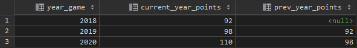

1. Создание таблицы

``` sql
CREATE TABLE statistic(
    player_name VARCHAR(100) NOT NULL,
    player_id INT NOT NULL,
    year_game SMALLINT NOT NULL CHECK (year_game > 0),
    points DECIMAL(12,2) CHECK (points >= 0),
    PRIMARY KEY (player_name,year_game));
```

2. Наполнение данными

``` sql
INSERT INTO
    statistic(player_name, player_id, year_game, points)
VALUES
    ('Mike',1,2018,18),
    ('Jack',2,2018,14),
    ('Jackie',3,2018,30),
    ('Jet',4,2018,30),
    ('Luke',1,2019,16),
    ('Mike',2,2019,14),
    ('Jack',3,2019,15),
    ('Jackie',4,2019,28),
    ('Jet',5,2019,25),
    ('Luke',1,2020,19),
    ('Mike',2,2020,17),
    ('Jack',3,2020,18),
    ('Jackie',4,2020,29),
    ('Jet',5,2020,27);
```

3. Запрос на вывод суммы очков с выполнением группировки и сортировки по годам.
``` sql
SELECT s.year_game, sum(s.points)
FROM statistic AS s
GROUP BY s.year_game
ORDER BY s.year_game;
```

Результат работы скрипта:


4. Запрос на вывод суммы очков с выполнением группировки и сортировки по годам с использованием CTE.

``` sql
WITH cte
    AS ( SELECT statistic.year_game, statistic.points FROM statistic )
SELECT cte.year_game, sum(cte.points) FROM cte
GROUP BY cte.year_game;
```
Результат работы скрипта:


5. Скрипт подсчета очков по всем игрокам и вывод очков за предыдущий год

``` sql
WITH cte
AS
    ( 
        SELECT s.year_game, SUM(s.points) AS current_year_points
        FROM statistic AS s
        GROUP BY s.year_game
        ORDER BY s.year_game
    )
SELECT 
    year_game, current_year_points, LAG(current_year_points, 1) OVER (ORDER BY year_game) prev_year_points
FROM cte;
```



**Вывод:**
Использование оконной функции оказалось достаточно удобно, для вывода данных, где необходимо сравнение значений за различные периоды времени, так как сократило/упростило синтаксис запроса.