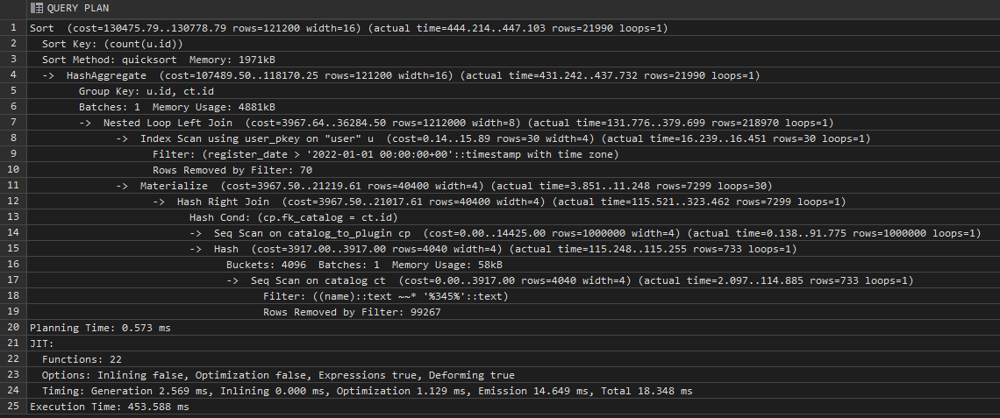
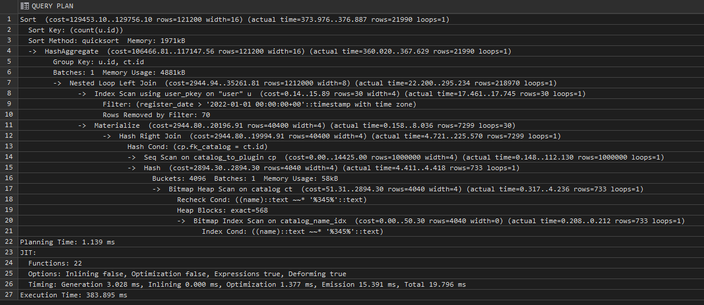
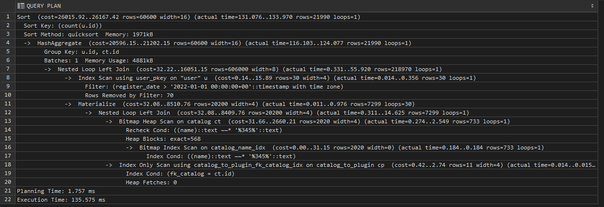

Запрос делает выборку по загрузкам пользователей, чья дата регистрации больше **2022-01-01**, для каталогов имя которых содержит сочетание символов **'345'**
``` sql
EXPLAIN ANALYSE 
SELECT u.id AS user_id, ct.id AS catalog_id, COUNT(u.id) AS download_count
FROM user_host."user" AS u
    LEFT JOIN plugin_host.catalog AS ct ON ct.name ILIKE '%345%'
    LEFT JOIN plugin_host.catalog_to_plugin AS cp ON ct.id = cp.fk_catalog
WHERE 
    u.register_date > '2022-10-01'
GROUP BY (u.id, ct.id)
ORDER BY download_count;
```



Первоначальный вариант выполняется примерно за **450 ms**

Далее создаю GIN индекс по имени каталогов.

``` sql
CREATE EXTENSION IF NOT EXISTS pg_trgm;
UPDATE pg_opclass SET opcdefault = true WHERE opcname='gin_trgm_ops';
CREATE INDEX ON plugin_host.catalog USING GIN (name);
```



Время выполнения снижается до **380 ms**. 

Далее создаю B-tree индексы по дате регистрации пользователей и внешним ключам таблиц *download* и *catalog_to_plugin*.

``` sql
CREATE INDEX ON user_host."user" (register_date);
CREATE INDEX ON plugin_host.download(fk_user);
CREATE INDEX ON plugin_host.catalog_to_plugin(fk_catalog);
```



В результате время выполнения запроса снизилось до **135 ms**.

Из анализа итогового плана запроса можно сделать вывод, что индекс по дате регистрации пользователя оказал малое влияние на запрос, так как планировщик предпочел произвести фильтрацию без использования индекса.
Скорее всего, это связано с тем, что таких пользователей более 40% таблицы.
При других соотношениях данных, например выбора узкого диапазона дат, он должен также задействоваться.
