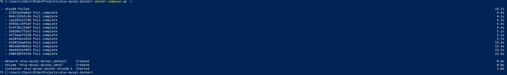
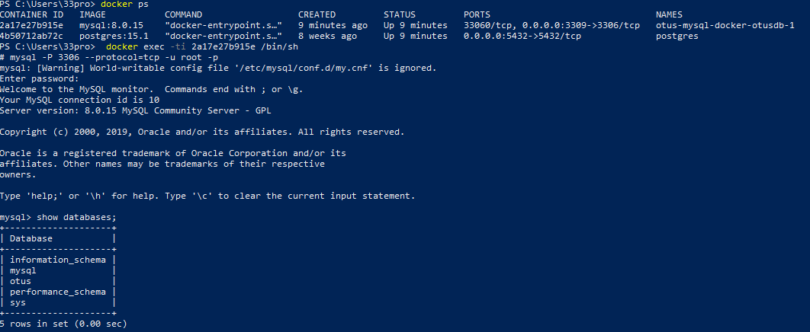

docker-compose использовал без изменений

```
version: '3.1'

services:
otusdb:
image: mysql:8.0.15
environment:
- MYSQL_ROOT_PASSWORD=12345
command:
--init-file /init.sql
volumes:
- data:/var/lib/mysql
- ./init.sql:/init.sql
- ./custom.conf:/etc/mysql/conf.d
expose:
- "3306"
ports:
- "3309:3306"

volumes:
data:
```

Отредактировал файл my.conf. В частности внес настройки по количеству соединений, размеру буфера и прочему.

```
[mysqld]
port=3306
default-authentication-plugin=mysql_native_password
innodb_buffer_pool_size = 2147483648
basedir = /opt/mysql
max_connections = 100
max_connect_errors = 1000
max_allowed_packet = 128M
interactive_timeout = 1800
wait_timeout = 1800
long_query_time = 8
innodb_buffer_pool_size = 1G
innodb_write_io_threads = 4
innodb_read_io_threads = 4
```

Инсталировал докер образ:



Зашел в контейнер и подключился к mysql.
```
mysql -P 3306 --protocol=tcp -u root -p
```

Командой *show databases;* проверил работоспособность.



