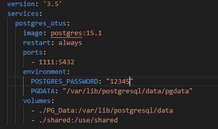
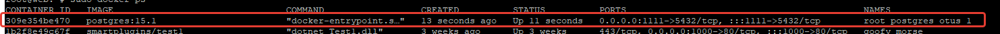
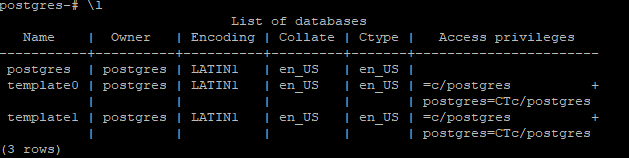
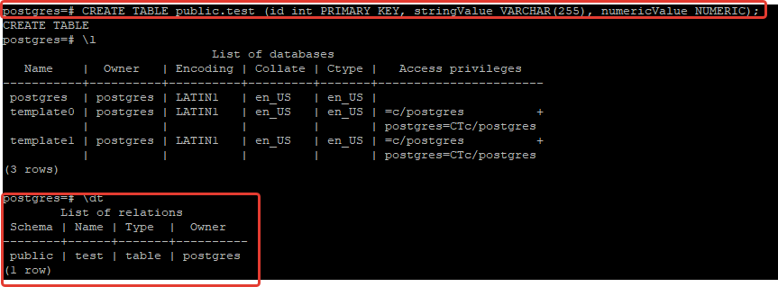
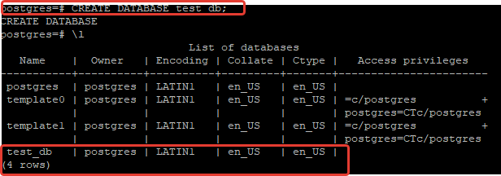
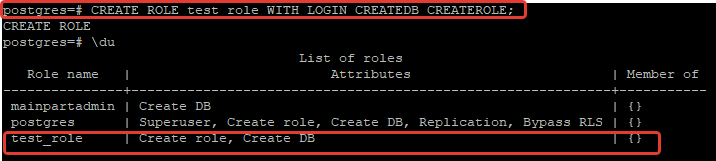
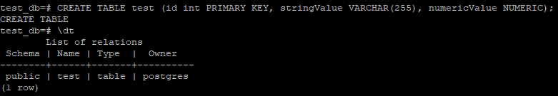

# Установка СУБД PostgreSQL.

## Установка
Запуск postgresql выпонен в виде развертывания docker контейнера на VPS сервере.
Был создан файл **docker-compose** и выполнена команда **docker-compose up -d**. 

См. рис. ниже:

## Подключение

Выполнено подключение к системному пользователю, при помощи команды **su postgres**

При помощи команды **\l** получен список созданых на текущий момент базах

## Создание таблицы

Скрипт создания таблицы:
**CREATE TABLE public.test (id int PRIMARY KEY, stringValue VARCHAR(255), numericValue NUMERIC);**

## Создание базы данных

**CREATE DATABASE test_db;**

При помощи команды **\l** получен список созданых на текущий момент базах

## Создание новой роли
Скрипт создания роли:
**CREATE ROLE test_role WITH LOGIN CREATEDB CREATEROLE;**
 

## Создание новой таблицы в тестовой базе данных

Подключаемся к тестовой базе данных:

**postgres=# psql -d test_db -U postgres**

Создаем новую таблицу при помощи скрипта:

**CREATE TABLE test (id int PRIMARY KEY, stringValue VARCHAR(255), numericValue NUMERIC);**
 

